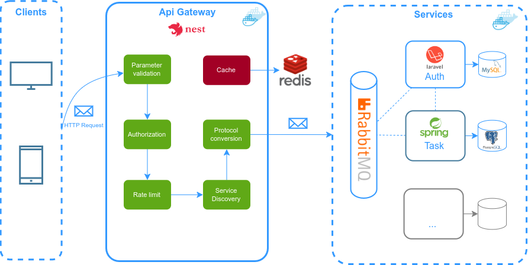

# Task Manager Microservice

I've combined NestJS, Laravel, and Spring Boot to build a dynamic and scalable ecosystem using a microservice architecture approach. With the NestJS API Gateway, I've made it easy to access my microservices. The Laravel microservice takes charge of user authentication and management, while the Spring Boot microservice efficiently handles task management. I've containerized all components using Docker to ensure smooth deployment. This project is a work in progress, and my intention is to further extend its scope by incorporating additional microservices utilizing diverse programming languages in the times ahead.

## Architecture



## Technologies

- [Spring Boot](https://spring.io/projects/spring-boot)
- [NestJs](https://nestjs.com/)
- [Laravel](https://laravel.com/)
- [Redis](https://redis.io/)
- [PostgreSQL](https://www.postgresql.org/)
- [MySQL](https://www.mysql.com/)
- [RabbitMQ](https://www.rabbitmq.com/)
- [Docker](https://www.docker.com/)

## Run services

```shell
  ./docker up
```

## Stop services

```shell
  ./docker down
```

## Add services to the same network

```shell
  ./docker network
```
